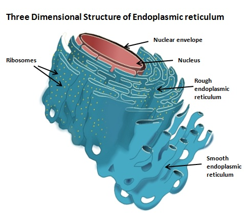

### Theory

The endoplasmic reticulum (ER) is a network of membranous sacs that form interconnected tubules, vesicles, and cisternae. In 1945, Ernest Fullam, Keith Porter, and Albert Claude first observed the endoplasmic reticulum. The ER membrane is continuous with the outer nuclear membrane. Eukaryotic cells possess the ER. The ER membrane synthesizes most of the transmembrane proteins and lipids required for the cell’s organelles.

The ER performs several functions within the cell, including protein synthesis, steroid production, calcium sequestration, and the storage and production of glycogen. Additionally, most of the lipids for mitochondrial and peroxisomal membranes are synthesized by the ER.

There are two types of ER: rough ER and smooth ER. The rough ER is studded with ribosomes, giving it a rough appearance, whereas the smooth ER lacks ribosomes. The endoplasmic reticulum is a highly versatile organelle involved in the synthesis and transport of proteins, glycoproteins, and lipoproteins; the synthesis of cholesterol, steroids, phospholipids, and triglycerides; the degradation of glycogen; and the metabolism of xenobiotics.

 

### Structure

The rough ER is associated  with ribosomes which is the site protein synthesis. The ribosome free ER is known as smooth ER which is the  centre of lipid and membrane protein synthesis.

 

 

#### Rough Endoplasmic Reticulum (RER)

RER is arranged as a series of stacked membranes close to the nucleus. They appear rough as there are large number of ribosome attached to the cytoplasmic side of their membranes. The ribosomes undergo the function of protein synthesis.

Regions of cytoplasmic matrix containing RER take basic stain due to the RNA content of ribosomes. These regions are known as cergastoplasm or basophilic bodies or chromophilic substances by early cytologists. In nerve cells such regions are called nissl bodies. In RER, ribosomes are often present as polysomes held together by mRNA.

 
 

#### Smooth Endoplasmic Reticulum (SER)
 
SER appear smooth as ribosomes are not attached to their walls. It occurs in cells involved in the metabolism of lipids and glycogen. Muscle cells have numerous SER and are known as sarcoplasmic reticulum. Smooth ER is also abundant in hepatocytes which is the principal  site of production of lipoproteins which are carriers of lipids to various parts of the body through the bloodstream. The SER consists of tubules and vesicles that  forming a network, which increased surface area for the action and storage  of key enzymes and the product of these enzymes.

 
 

#### Sarcoplasmic reticulum

Sarcoplasmic reticulum is a type of smooth ER found in smooth and striated muscles. The SER synthesizes molecules while the SR stores and pumps calcium ions. Calcium was stored in the  SR, which it sequesters and then releases when the muscle cell is stimulated. The release of calcium by SR during electrical stimulation of the cell plays a important role in excitation-contraction coupling.

 

 

#### Functions of  ER

The functions of SER include steroid metabolism, regulation of calcium concentration, metabolism of carbohydrates, synthesis of lipids and steroids, drug detoxification. 

The enzyme glucose-6-phosphatasepresentin SER  which converts glucose-6-phosphate to glucose, which is a  step in gluconeogenesis.

ER also contains enzymes that catalyze the detoxification of certain drugs and harmful substances produced by metabolism.
ER also serves as an intracellular Ca 2+ store which are used in many cell signaling processes. Sarcoplasmic reticulum in muscle cells are also specialized in Ca 2+ storage.